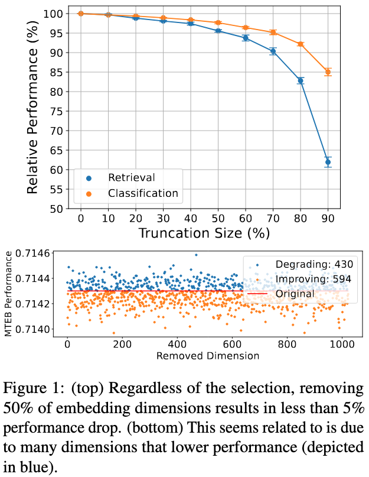

# Randomly Removing 50% of Dimensions in Text Embeddings has Minimal Impact on Retrieval and Classification Tasks

This repository is an official code base for our paper, [Randomly Removing 50% of Dimensions in Text Embeddings has Minimal Impact on Retrieval and Classification Tasks](https://arxiv.org/abs/2508.17744) (EMNLP main, 2025).

## TLDR



1. We found that a lot dimensions can be removed from text embeddings without losing much performance on retrieval and classification.
2. We performance a series of analysis trying to understand the logic behind 1.

## Abstract

In this paper, we study the surprising impact that truncating text embeddings has on downstream performance. We consistently observe across 6 state-of-the-art text encoders and 26 downstream tasks, that randomly removing up to 50% of embedding dimensions results in only a minor drop in performance, less than 10%, in retrieval and classification tasks. Given the benefits of using smaller-sized embeddings, as well as the potential insights about text encoding, we study this phenomenon and find that, contrary to what is suggested in prior work, this is not the result of an ineffective use of representation space. Instead, we find that a large number of uniformly distributed dimensions actually cause an increase in performance when removed. This would explain why, on average, removing a large number of embedding dimensions results in a marginal drop in performance. We make similar observations when truncating the embeddings used by large language models to make next-token predictions on generative tasks, suggesting that this phenomenon is not isolated to classification or retrieval tasks.

## Repository structure

This repository contains the following sub-directories which have corresponding experiments in our paper,

- `minimal/`
    - Minimal example experiment. See a section below for more details.
- `last_k_truncation_beir/`
    - Remove the last K% of dimensions from embeddings and evaluate on retrieval datasets. See more details in the README file in this sub-directory.
- `last_k_truncation_mteb/`
    - Remove the last K% of dimensions from embeddings and evaluate on classification datasets. See more details in the README file in this sub-directory.
- `random_k_truncation_beir/`
    - Remove randomly K% of dimensions from embeddings and evaluate on retrieval datasets. See more details in the README file in this sub-directory.
- `random_k_truncation_mteb/`
    - Remove randomly K% of dimensions from embeddings and evaluate on classification datasets. See more details in the README file in this sub-directory.
- `dimension_attribution_analysis_beir/`
    - Perform *dimension attribution analysis*, repeat evaluation with one dimension removed at each time, on retrieval datasets. See more details in the README file in this sub-directory.
- `dimension_attribution_analysis_mteb/`
    - Perform *dimension attribution analysis*, repeat evaluation with one dimension removed at each time, on classification datasets. See more details in the README file in this sub-directory.


## Installation

This code base relies on [uv](https://docs.astral.sh/uv/) for dependency management (like all Python projects should be). If you don't have `uv` in your system, check [the official documentation](https://docs.astral.sh/uv/getting-started/installation/) to install it.

With `uv`, just run the following command to install all packages required to run this code base.

```sh
uv sync
```

## Minimal example

We provide a quick a simple way to reproduce a part of our experiments under `src/random_embedding_truncation/minimal/`. This script allows you to quickly see it is indeed possible to retain most of original performance even after removing 50% of dimensions.

To try it, you can run,

```sh
uv run python src/random_embedding_truncation/minimal/retrieval.py
```

This will run the following two evaluation experiments and print the result,

- Experiment 1: Evaluate [sentence-t5](https://huggingface.co/sentence-transformers/sentence-t5-base) encoder on [the small version of MSMarco](https://huggingface.co/datasets/zeta-alpha-ai/NanoMSMARCO). Standard evaluation that uses all dimensions from embeddings,
- Experiment 2: Same model and dataset but the last 50% of dimensions are removed right after the encoding.

Running the command above will run these evaluations, print the performance for each, as well as how much performance is retrained after the truncation (which we call relative performance in our paper).

The script is only 50 lines of code (mostly loading model and stuff...). You can modify this script to try the same experiment with different datasets, models, and truncation level.


## Truncator

`Truncator` class at `src/random_embedding_truncation/truncator.py` takes care of removing dimensions from embeddings produced by SentenceTransformer model. Take a look at its `encode` method to see how we remove dimensions.

Although, it is not more than just,

```py
truncated_vecs = original_vecs[:end]
```
